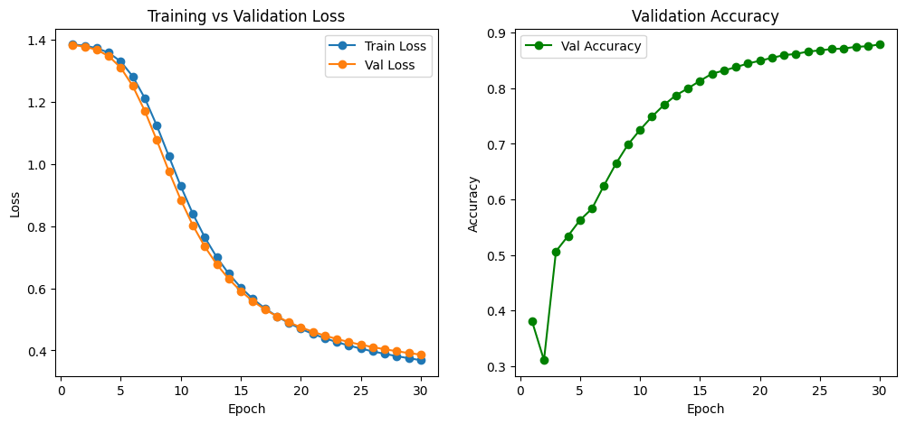
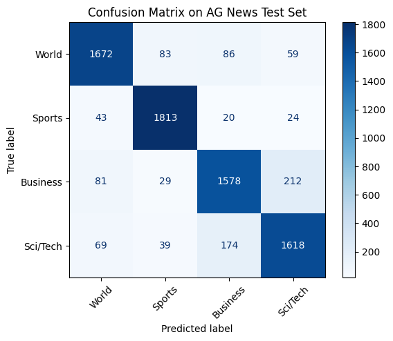

# AG News Text Classification (PyTorch, EmbeddingBag)

A from-scratch news topic classifier trained on the **AG News** dataset using a fast and simple **EmbeddingBag → Linear** architecture.  
This project is designed as a **teaching-style notebook**: every step is explained, with math where it helps intuition.

<p align="left">
  
  
  
  
</p>

**Why this repo?**  
- Clean, reproducible baseline for text classification  
- Clear walkthrough of: tokenization → vocabulary → batching with `offsets` → `EmbeddingBag` → training → evaluation → inference  
- Includes the **math** behind embeddings, linear layers, and cross-entropy (explained intuitively)

---

## 📦 What’s inside

- **Notebook:** `notebooks/ag_news_classifier.ipynb` (step-by-step, with plots)
- **Weights:** `models/best_model.pth` (best validation checkpoint via early stopping)
- **Report assets:** confusion matrix & curves (optional images in `reports/`)
- **This README:** a mini-tutorial you can learn from and reuse

> If you prefer Colab, open the notebook there and run end-to-end.

---

## 🚀 Quickstart

```bash
git clone https://github.com/your-username/AG-News-Classification.git
cd AG-News-Classification
pip install -r requirements.txt

# Open the tutorial notebook
jupyter notebook notebooks/ag_news_classifier.ipynb
```

> Notes :
> - The dataset is loaded from Hugging Face Datasets (no manual download needed).
> - Best checkpoint is saved as best_model.pth in the working directory (you can move it to models/).

---

## 🗺️ Table of Contents

1. [Project Overview](#-project-overview)
2. [Dataset](#-dataset)
3. [Reproducibility](#-reproducibility)
4. [Preprocessing: Tokenizer → Vocab → IDs](#-preprocessing-tokenizer--vocab--ids)
5. [Batching with EmbeddingBag (Offsets)](#-batching-with-embeddingbag-and-offsets)
6. [Model Architecture: EmbeddingBag → Linear](#-model-architecture-embeddingbag--linear)
7. [Training: Loss, Optimizer, and Loop](#-training-the-model)
8. [Early Stopping & Best Model](#-early-stopping--best-model)
9. [Results: Curves & Confusion Matrix](#-results-curves--confusion-matrix)
10. [Inference: Using the Trained Model](#-inference-using-the-trained-model)
11. [Baselines: Context & Comparison](#-baselines-context--comparison)
12. [Lessons Learned](#-lessons-learned)
13. [Next Steps](#-next-steps)
14. [Repo Structure](#-repo-structure)
15. [References](#-references)

---

## 📘 Project Overview

The goal of this project is to build a **news topic classifier** from scratch using **PyTorch**.  
We train on the **AG News dataset**, which contains news headlines and short descriptions categorized into 4 topics:

- 🌍 World  
- 🏅 Sports  
- 💼 Business  
- 🔬 Science & Technology  

Instead of using heavy transformer models, we start simple:
- **Tokenizer → Vocabulary → Token IDs**
- **`EmbeddingBag`**: learns word embeddings and averages them per document
- **`Linear` layer**: maps embeddings to 4 class logits
- **Cross-Entropy Loss**: optimizes predicted class probabilities
- **Early Stopping**: saves the best model and prevents overfitting

This approach reaches ~**88% validation accuracy**, competitive with classical NLP baselines.

---

## 📊 Dataset

**AG News** is a balanced dataset:
- **Train**: 120,000 samples (~30K per class)  
- **Test**: 7,600 samples (~1.9K per class)  

✅ Balanced classes → no class dominates learning.  

**Example**

- **Label**: Business
- **Text**: "Oil and Economy Cloud Stocks' Outlook (Reuters) Soaring crude prices plus worries about the economy and the outlook for earnings..."

We load the dataset directly from [Hugging Face Datasets](https://huggingface.co/datasets/ag_news).

---

## 🎯 Reproducibility

Reproducibility is crucial in ML so results don’t vary across runs.

We fix:
- Python’s built-in random seed
- NumPy seed
- PyTorch seed (`torch.manual_seed`)
- Use deterministic backend settings in PyTorch

This ensures:
- Stable model initialization  
- Consistent batch shuffling  
- Comparable results across training runs

---

## 🔡 Preprocessing: Tokenizer → Vocab → IDs

Neural networks cannot work directly with raw text.  
We need to transform words into **numerical representations** that can be fed into our model.  

Our preprocessing pipeline has 4 key steps:

1. **Tokenization**  
   - Split raw text into lowercase tokens (words).  
   - Example:  
     `"The stock market is soaring"` → `['the', 'stock', 'market', 'is', 'soaring']`

2. **Vocabulary Building**  
   - Construct a mapping from tokens to integer IDs.  
   - Example:  
     `{'the': 8, 'stock': 72, 'market': 55, 'is': 185, 'soaring': 61}`  
   - Vocabulary size in this project: **~44K tokens**.

3. **Handling Unknown Words (`<unk>`)**  
   - Words not seen during training are mapped to `<unk>`.  
   - Ensures the model can still process new/unseen words.

4. **Numericalization**  
   - Convert tokenized text into sequences of IDs.  
   - Example:  
     `['the', 'stock', 'market', 'is', 'soaring'] → [8, 72, 55, 185, 61]`

---

### 🔬 Why this matters

- Tokens become the **indices** used to lookup embeddings.  
- Without `<unk>`, unseen words would break inference.  
- Vocabulary acts like a **dictionary** between text and model input.

---

### 📐 Math Intuition: Embedding Matrix

The **embedding matrix** is:

$$
E \in \mathbb{R}^{V \times d}
$$

where:  
- $V$ = vocabulary size (~44K)  
- $d$ = embedding dimension (64 in our case)  

Each word $w$ has a vector:

$$
\mathbf{e}_w = E[w] \in \mathbb{R}^d
$$

**Training effect:**  
Embeddings start random but are updated during training so that words with similar meanings move closer together in vector space.

---

## 📦 Batching with `EmbeddingBag` and Offsets

Texts have variable lengths — one news headline might be 5 words, another 25.  
Normally, we would **pad shorter sequences** to make them the same length before batching.  

⚡ Instead, we use **`EmbeddingBag` with offsets**, which removes the need for padding.

---

### 🔹 How batching works

When a batch is created:

- `text` → a **flattened list** of all token IDs from every document in the batch  
- `offsets` → tells PyTorch where each document starts inside `text`  
- `labels` → the true class for each document

**Example with 3 documents:**

Batch of documents:
- Doc1: [8, 72]
- Doc2: [55, 185, 61]
- Doc3: [99]

- Flattened text tensor: [8, 72, 55, 185, 61, 99]
- Offsets: [0, 2, 5] # indices where each new doc starts
- Labels: [World, Business, Sports]


---

### 🔹 What `EmbeddingBag` does

Instead of returning embeddings for each token, it:
1. Looks up embeddings for each token in a document
2. Averages them into a **single vector per document**

So if:
- Batch size = 3
- Embedding dimension = 64

Then after `EmbeddingBag` you get:
- Input: text=[...] (length=6), offsets=[0,2,5]
- Output: [3 x 64] tensor (one 64-dim vector per doc)


---

### 📐 Math view

For a document $d$ with tokens $T_d$:

$$
\mathbf{v}_d = \frac{1}{|T_d|} \sum_{t \in T_d} E[t] \quad \in \mathbb{R}^d
$$

where:
- $E[t]$ = embedding of token $t$
- $|T_d|$ = number of tokens in document $d$

Thus, batching works without padding: the offsets + flattened text fully describe the batch.

---

## 🏗️ Model Architecture: `EmbeddingBag → Linear`

Our model is intentionally simple:

1. **EmbeddingBag Layer**  
   - Input: token IDs (flattened text + offsets)  
   - Output: averaged embeddings per document → `[batch_size, embed_dim]`

2. **Linear Layer**  
   - Input: document embedding → `[batch_size, embed_dim]`  
   - Output: class logits → `[batch_size, num_classes]`

---

### 🔹 Shape Flow (with examples)

Suppose:
- Vocab size $V = 44{,}120$
- Embedding dimension $d = 64$
- Number of classes $C = 4$
- Batch size $B = 32$

Then:
- Token IDs → EmbeddingBag → Linear
- [B x variable_length] → [B x 64] → [B x 4]


- After `EmbeddingBag`: `[32 x 64]`
- After Linear: `[32 x 4]`

---

### 📐 Math View

The **Linear layer** computes:

$$
\mathbf{z} = W \mathbf{x} + \mathbf{b}
$$

where:
- $\mathbf{x} \in \mathbb{R}^d$ = document embedding  
- $W \in \mathbb{R}^{C \times d}$ = weight matrix  
- $\mathbf{b} \in \mathbb{R}^C$ = bias  
- $\mathbf{z} \in \mathbb{R}^C$ = logits (scores for each class)

In expanded form for class $j$:

$$
z_j = \sum_{i=1}^{d} W_{j,i} \, x_i + b_j
$$

- $z_j$ = score for class $j$  
- Argmax picks the class with the highest logit.

---

### 🔹 Why this works

- `EmbeddingBag` reduces each document to a **fixed-length vector**.  
- `Linear` maps that vector into **class scores**.  
- Together, this is a fast, interpretable baseline for text classification.

---

## 🏋️ Training the Model

Once the model is defined, we need to **train it** so the weights (embeddings + linear layer) adapt to the data.  

Training has 3 key ingredients:

---

### 1. Loss Function — Cross-Entropy

We use **Cross-Entropy Loss** because:
- It compares predicted class probabilities with the true class label.
- It penalizes the model more when it’s confident but wrong.

Mathematically:

$$
\text{CE}(\mathbf{z}, y) = - \log \frac{\exp(z_y)}{\sum_{k=1}^{C} \exp(z_k)}
$$

where:
- $\mathbf{z} \in \mathbb{R}^C$ are the logits for all classes  
- $y$ = true class index  
- $C$ = number of classes (4)

---

### 2. Optimizer

We use **Stochastic Gradient Descent (SGD)** or **Adam**:
- Computes gradients of loss w.r.t parameters
- Updates weights to reduce future loss

Update rule:

$$
\theta \leftarrow \theta - \eta \, \nabla_\theta \text{Loss}
$$

- $\theta$ = model parameters (weights & biases)  
- $\eta$ = learning rate  

---

### 3. Training Loop

Each **epoch** = one full pass over the training set.  
Each **batch** = a subset of documents used to estimate gradients.

Steps per batch:
1. **Forward pass** → compute logits  
2. **Loss** → Cross-Entropy  
3. **Backward pass** → gradients (`loss.backward()`)  
4. **Update weights** → optimizer step  
5. **Reset gradients** → `optimizer.zero_grad()`

---

### 🔹 Why shuffle and batch?

- **Shuffling** → prevents order bias (model doesn’t memorize sequence).  
- **Batching** → stabilizes gradient estimates and makes training efficient.

---

### 🔹 Epoch vs Batch

- One epoch = all data seen once.  
- Each epoch consists of multiple batches.  
- For example: with 120,000 samples and batch size 32 → ~3,750 updates per epoch.

---

## 🛑 Early Stopping & Saving the Best Model

Training longer doesn’t always mean better results.  
After a certain point, the model may **overfit** — memorizing the training data while performing worse on unseen data.  

To prevent this, we use:

---

### 🔹 Validation Set
- Training data is split into **train** and **validation**.  
- After each epoch, we evaluate the model on the validation set.  
- Metrics: **validation loss** and **validation accuracy**.

---

### 🔹 Early Stopping
We stop training when validation loss stops improving.

- Patience = 3 epochs → if val loss doesn’t improve for 3 epochs, stop.  
- Prevents wasting compute and avoids overfitting.  

---

### 🔹 Saving the Best Model
Whenever validation loss improves, we save a checkpoint:

```python
torch.save(model.state_dict(), "best_model.pth")

# Only the best version is saved, not every epoch.
# At the end, we reload the best checkpoint:

model.load_state_dict(torch.load("best_model.pth"))
```

### 📐 Math Intuition

Training minimizes **training loss**:

$$
\mathcal{L}_{train} = \frac{1}{N_{train}} \sum_{i=1}^{N_{train}} \text{CE}(z^{(i)}, y^{(i)})
$$

Validation monitors **generalization loss**:

$$
\mathcal{L}_{val} = \frac{1}{N_{val}} \sum_{i=1}^{N_{val}} \text{CE}(z^{(i)}, y^{(i)})
$$

Early stopping ensures we keep the model at the epoch where $\mathcal{L}_{val}$ is lowest.

---

## 📊 Results: Curves & Confusion Matrix

After training with early stopping, our model reached:

- **Validation Accuracy:** ~88%  
- **Validation Loss:** steadily decreased across epochs  

---

### 🔹 Training vs Validation Loss & Validation Accuracy Curve

<p align="center">
  
</p>

✅ Observation: 
- training and validation loss both decrease, showing stable learning with no major overfitting.
- accuracy improves steadily and stabilizes near 88%.

---

### 🔹 Confusion Matrix

<p align="center">
  
</p>

✅ Findings:
- **Sports** is the easiest class to predict (highest precision & recall).  
- **Business vs Sci/Tech** shows the most confusion → likely due to overlapping vocabulary like “market,” “stocks,” “technology.”  
- **World** is also strong, with clear geographical/region-based keywords.

---

### 🔹 Final Performance Summary

- Balanced dataset → no bias toward one class  
- Model achieves accuracy similar to early deep learning baselines (TextCNN)  
- Still behind pretrained embeddings and transformers (FastText ~92%, BERT ~94–95%)

---

## 🔮 Inference: Using the Trained Model

Once training is complete, we load the **best saved checkpoint** (`best_model.pth`) and run predictions.

---

### 🔹 Reload the Best Model

```python
model = TextClassifier(vocab_size=len(vocab), embed_dim=64, num_classes=4)
model.load_state_dict(torch.load("best_model.pth"))
model.eval()
```
- eval() switches the model into inference mode (disables dropout, etc.).
- This ensures stable predictions.

### 🔹 Predict Function
We define a helper to tokenize → numericalize → run through the model:

```python
def predict(text, model, vocab, tokenizer, label_names):
    tokens = tokenizer(text)
    token_ids = [vocab.get(token, vocab["<unk>"]) for token in tokens]

    text_tensor = torch.tensor(token_ids, dtype=torch.int64)
    offsets = torch.tensor([0])   # single document → start at 0

    with torch.no_grad():
        logits = model(text_tensor, offsets)
        predicted_class = logits.argmax(1).item()
    return label_names[predicted_class]
```

### 🔹 Example Predictions

```python
sample_texts = [
    "NASA announces breakthrough discovery in space research",
    "Stock market hits record high amid global economic recovery",
    "Manchester United wins the Premier League title",
    "UN calls for peace talks in the Middle East"
]

for text in sample_texts:
    print(text, "→", predict(text, model, vocab, tokenizer, label_names))
```

#### ✅ Example Output:
- `NASA announces breakthrough discovery...` → `Sci/Tech`
- `Stock market hits record high...` → `Business`
- `Manchester United wins...` → `Sports`
- `UN calls for peace talks...` → `World`

### 🔹 Testing on AG News Test Set
We can also evaluate on the official test split (7.6K samples):
- Compute overall accuracy
- Generate classification report (precision, recall, F1-score per class)
- Compare with validation results

✅ This section shows practical **how-to-use**, not just theory.

---

## 📊 Baselines: Context & Comparison

To put our results (~88% validation accuracy) into perspective, here’s how they compare against known baselines on the AG News dataset:

| Model                           | Accuracy |
|---------------------------------|----------|
| Random Guessing                 | 25%      |
| Naive Bayes                     | ~83%     |
| Logistic Regression (BoW/TF-IDF)| ~84%     |
| TextCNN (Kim, 2014)             | ~87%     |
| **EmbeddingBag + Linear (ours)**| **~88%** |
| FastText (Joulin et al., 2016)  | ~92%     |
| DistilBERT / BERT               | 94–95%   |
| RoBERTa / XLNet                 | 96%+     |

---

### 🔹 Insights

- Our **simple baseline** matches or beats classical methods like Logistic Regression and TextCNN.  
- Still behind **FastText** and **transformer-based models** (which leverage pretrained embeddings).  
- Strength of this project → clarity, speed, and educational value. 

---

✅ Shows how you can start from scratch and still achieve competitive performance before moving to larger models.

---

## 📚 Lessons Learned

This project wasn’t just about reaching accuracy — it was about **understanding how text classification works under the hood**.  

Here are the key concepts I learned:

---

### 🔹 Embeddings
- Words are represented as vectors in a high-dimensional space.  
- Initially random → updated during training.  
- Similar words (e.g., *economy*, *market*) become closer in embedding space.  

---

### 🔹 EmbeddingBag & Offsets
- Instead of padding sequences, we flatten token IDs and use offsets.  
- `EmbeddingBag` aggregates embeddings (mean) → one fixed-size vector per document.  
- Efficient and avoids wasted computation.  

---

### 🔹 Linear Layer
- Applies a simple transformation:

$$
\mathbf{z} = W \mathbf{x} + \mathbf{b}
$$

- Maps document embeddings → class scores (logits).

---

### 🔹 Cross-Entropy Loss

Encourages the true class probability to be as close to 1 as possible.

**Formula:**

$$
\text{CE}(\mathbf{z}, y) = -\log \frac{\exp(z_y)}{\sum_{k=1}^C \exp(z_k)}
$$

---

### 🔹 Training Dynamics
- One **epoch** = full pass over training data.  
- Data is shuffled each epoch to avoid order bias.  
- Mini-batches give a balance between stability and speed.  

---

### 🔹 Early Stopping
- Stops training when validation loss stops improving.  
- Prevents overfitting and saves the best checkpoint automatically.  

---

✅ These lessons built a strong foundation for moving on to **pretrained embeddings** and **transformer models** in future projects.

---
## 🔮 Next Steps

This project built a **strong baseline** (~88% accuracy) with a simple architecture.  
There are several ways to extend and improve it:

---

### 1. Pretrained Embeddings
- Replace randomly initialized embeddings with **GloVe** or **FastText**.  
- Likely improves accuracy and captures richer word semantics.

---

### 2. Transformer Fine-Tuning
- Use **DistilBERT** or **BERT** with Hugging Face Transformers.  
- Reported results: 94–95% accuracy on AG News.  
- Would demonstrate modern NLP best practices.

---

### 3. Model Deployment
- Wrap the trained model into a **Streamlit or Gradio app**.  
- Let users type headlines and get instant predictions.  
- Makes the project interactive and portfolio-friendly.

---

### 4. Experiment with Other Datasets
- Reuse the same pipeline for the **Emotion dataset** (happy, sad, angry, etc.).  
- Compare results with AG News — shows transferability of approach.

---

### 5. Advanced Regularization
- Add **dropout** in embeddings or linear layer.  
- Try **label smoothing** or **focal loss** for harder classification tasks.

---

✅ These steps would push the project beyond a baseline, making it competitive with modern NLP workflows.

---

## 📂 Repo Structure

The repository is organized for clarity and reproducibility:

```text
AG-News-Classification/
├── notebooks/
│   └── ag_news_classifier.ipynb   # Main notebook (step-by-step with explanations)
│
├── models/
│   └── best_model.pth             # Saved checkpoint (best validation accuracy)
│
├── reports/
│   ├── loss_curve.png             # Training vs validation loss plot
│   ├── val_accuracy.png           # Validation accuracy curve
│   └── confusion_matrix.png       # Confusion matrix visualization
│
├── data/                          # (Optional) small sample data or vocab file
│   └── README.md
│
├── requirements.txt               # Dependencies
└── README.md                      # This documentation
```
### 🔹 Notes
- `notebooks/` → keeps experiments and explanations
- `models/` → stores trained weights
- `reports/` → stores visual outputs
- `data/` → optional (avoid committing full datasets)
- `requirements.txt` → for easy environment setup
- `README.md` → serves as both tutorial + report

---

✅ This will render properly on GitHub with aligned tree formatting.  

---

## 📖 References

Key resources that informed this project:

- **Dataset**
  - AG News Dataset on Hugging Face: [https://huggingface.co/datasets/ag_news](https://huggingface.co/datasets/ag_news)

- **PyTorch Documentation**
  - EmbeddingBag: [https://pytorch.org/docs/stable/generated/torch.nn.EmbeddingBag.html](https://pytorch.org/docs/stable/generated/torch.nn.EmbeddingBag.html)  
  - CrossEntropyLoss: [https://pytorch.org/docs/stable/generated/torch.nn.CrossEntropyLoss.html](https://pytorch.org/docs/stable/generated/torch.nn.CrossEntropyLoss.html)  
  - DataLoader & batching: [https://pytorch.org/docs/stable/data.html](https://pytorch.org/docs/stable/data.html)

- **Baseline Papers**
  - Kim (2014), *Convolutional Neural Networks for Sentence Classification*  
  - Joulin et al. (2016), *FastText: Enriching Word Vectors with Subword Information*  
  - Devlin et al. (2018), *BERT: Pre-training of Deep Bidirectional Transformers for Language Understanding*  

- **Math & ML Theory**
  - Cross-Entropy explanation: [https://en.wikipedia.org/wiki/Cross_entropy](https://en.wikipedia.org/wiki/Cross_entropy)  
  - Softmax function: [https://en.wikipedia.org/wiki/Softmax_function](https://en.wikipedia.org/wiki/Softmax_function)

---

✅ These references connect this work to prior research and official docs, making the README useful not just as a project showcase but as a **learning resource**.

---
